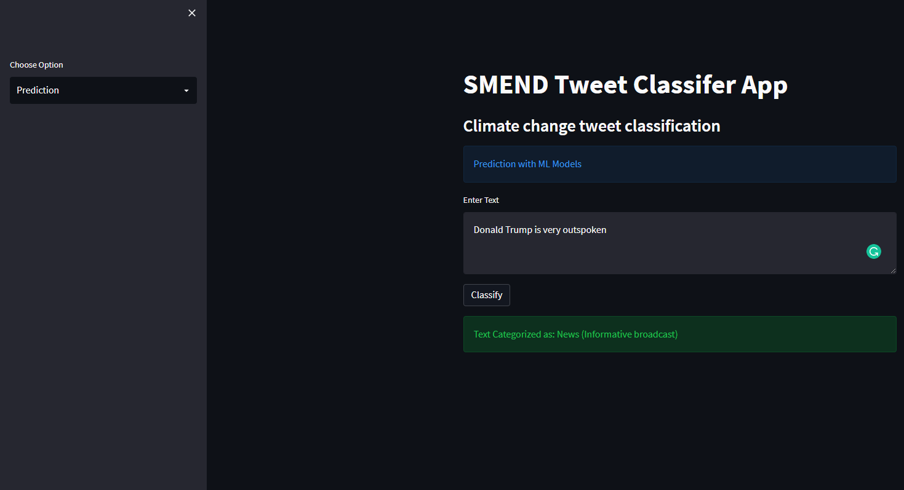
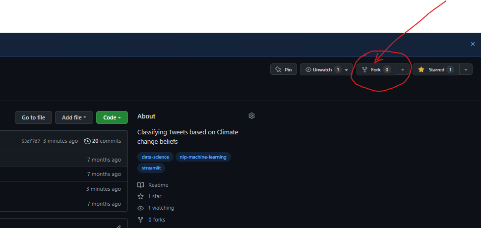

# A STREAMLIT APP ON TWEETS CLASSIFICATION

#### In Fulfilment of the requirement for the Data Science Professional Certificate at EXPLORE AI.


## 1) Summary of the Project
The aim of this project is to determine how people perceive climate change and whether or not they believe it is a real threat, by analysing tweets scraped from tweeter. 

In addition, a Streamlit App was created. This App processes a statement/tweet and gives a sentiment classification output based on the four classifications defined in the notebook.

The business value motivation of the project would be an improvement to companies' market research efforts in gauging how their product/service may be received.


For this repository, please refer to the following files:

| File Name              | Description                    |
| :--------------------- | :--------------------          |
| APP File               |                                |
| `ACEA_App.py`          |                                |
| RESOURCES              | Containing dependencies files  |
| `motebook.ipynb`       | Jupyter notebook               |
| `datasets`             | The train and test files       |
| `models`               | Trained modeks and vectorizers |




## 2) Project Usage Instruction

#### 2.1) Creating a copy of this repo

||| Kindly ```fork``` the repo and upvote if you find helpful.

  

To fork the repo, simply ensure that you are logged into your GitHub account, and then click on the 'fork' button at the top of this page as indicated within the figure above.

#### 2.2) Running the Streamlit web app on your local machine

As a first step to becoming familiar with our web app's functioning, we recommend setting up a running instance on your own local machine.

To do this, follow the steps below by running the given commands within a Git bash (Windows), or terminal (Mac/Linux):

 1. Ensure that you have the prerequisite Python libraries installed on your local machine:

 ```bash
 pip install -U streamlit numpy pandas scikit-learn
 ```

 2. Clone the *forked* repo to your local machine.

 ```bash
 git clone https://github.com/{your-account-name}/Sentiments-Analysis-Climate-Change.git
 ```  

 3. Navigate to the base of the cloned repo, and start the Streamlit app.

 ```bash
 streamlit run SMEND_App.py
 ```

 If the web server was able to initialise successfully, the following(or something similar) message should be displayed within your bash/terminal session:

```
  You can now view your Streamlit app in your browser.

    Local URL: http://localhost:8501
    Network URL: http://192.168.43.124:8501
```

You should also be automatically directed to the base page of your web app. This should look something like:


Thanks for interacting! Recommendations are welcome.
